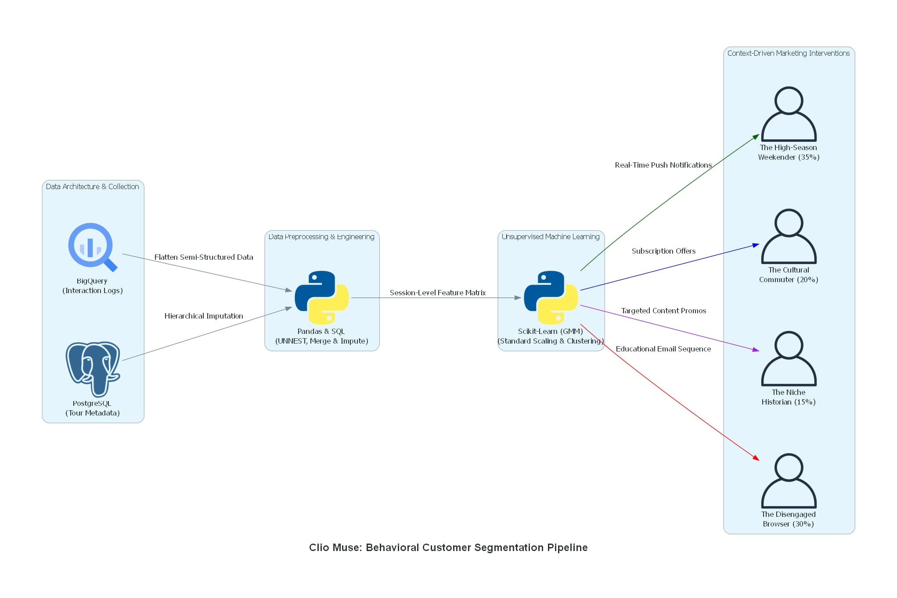
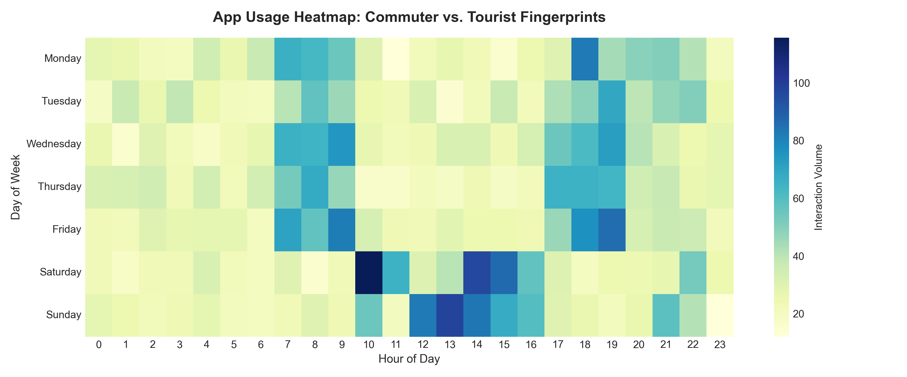
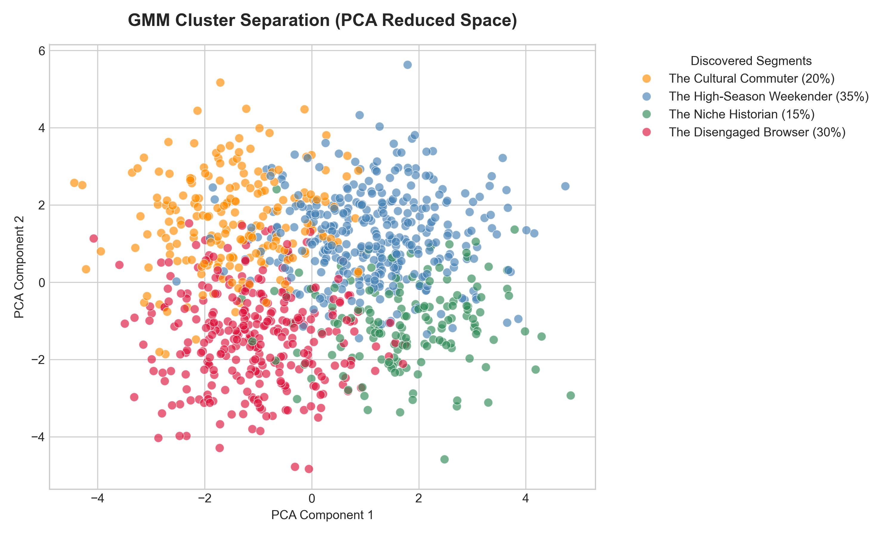
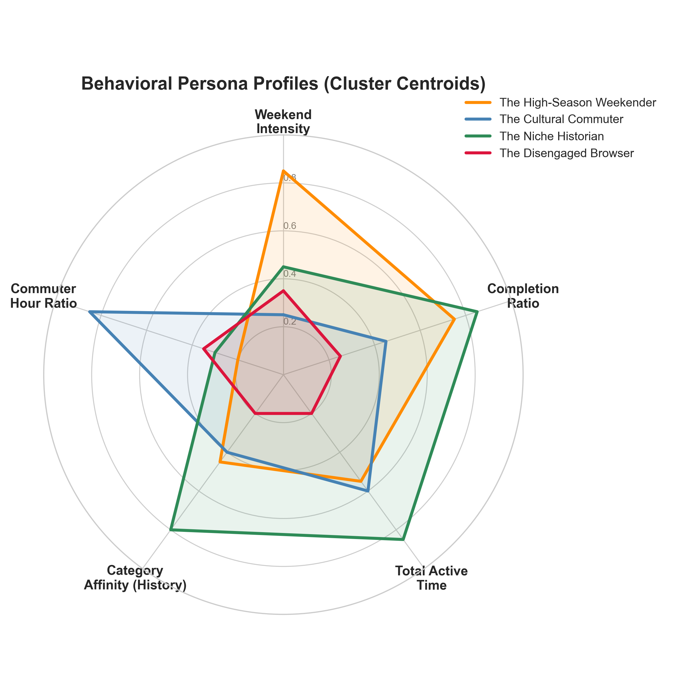

# Clio Muse: Behavioral Customer Segmentation

## Project Overview
**Objective:** To transition the marketing strategy from generic, demographic-based targeting to high-precision, context-driven segmentation by identifying distinct behavioral patterns within the audio tour user base.

**The Problem:** The marketing team relied on broad demographic data, failing to capture the dynamic **intent** of users (e.g., a local commuter vs. a weekend tourist).This lack of behavioral insight resulted in missed opportunities for cross-selling and retention, as strategies did not account for user context.

**The Solution:** I engineered an end-to-end unsupervised learning pipeline using **Gaussian Mixture Models (GMM)** to assign users to segments based on probability rather than binary rules.

**Key Outcomes:**
* **Discovered 4 distinct user types previously invisible to the business:** "The High-Season Weekender" (35%), "The Cultural Commuter" (20%), "The Niche Historian" (15%), and "The Disengaged Browser" (30%).
* **Context-Driven Strategy:** The analysis proved that behavior is driven by context (Commute vs. Travel) rather than demographics, validating a shift to lifecycle-specific campaigns.
* **Actionable Interventions:** Defined specific channels for each persona, such as Real-Time Push Notifications for tourists (geo-temporally bound) versus Educational Email Sequences for browsers (to reduce friction).

---
## System Architecture

---

## Data Architecture & Collection
* **Tour Data:** Collected data about tours (id, category) and stories (difficulty, language, duration, theme) from a **PostgreSQL** database.
* **Interaction Logs:** Collected interaction data between android/iOS users and audio tours from **BigQuery** using SQL.
* **Data Transformation:** The raw data in BigQuery was semi-structured with nested RECORD arrays. I used **Standard SQL** and the `UNNEST` function to flatten these structures and aggregate user behavior at the session level.
* **Ingestion:** Transformed raw logs into an “events” feature matrix in the form of a pandas dataframe using Python.

---

## Data Cleaning & Preprocessing
**Handling Missing Values**
* I handled missing theme categories for stories using **Hierarchical Imputation**.
* Since story categories inherit context from their parent tours, I propagated the known tour category attributes to fill gaps at the story level.
* I merged the stories dataframe with the events dataframe to derive new features, such as story completion rate for each user session.

**Handling Outliers ("Zombie" Sessions)**
* By analyzing the distribution of story completion rate, I identified users leaving the app running in the background (sessions exceeding 5 hours for 10-minute stories).
* To handle these “zombie” sessions, I applied a statistical filter to cap session duration at 120% of the audio track length and removed values beyond the 99th percentile.
* I filtered out "Micro-sessions" where the Completion Rate was less than 5% to ensure the algorithm focused on **intent-driven** behavior rather than UI navigation errors.

---

## Exploratory Data Analysis (EDA)
In this stage, I analyzed behavioral data to identify patterns crucial for clustering.

* **Completion Rate Classification:** Visualizations revealed users usually fall into two extremes: **skimmers** (10-20% completion) and **completers** (90%+ completion).
* **Micro-Seasonality:** I decomposed interaction timestamps to generate a **Usage Heatmap**. This revealed two distinct fingerprints: a 'Commuter Pattern' (spikes at 8 AM/6 PM weekdays) and a 'Tourist Pattern' (sustained high activity 10 AM–4 PM on weekends).

* **Macro-Seasonality:** Using seasonality decomposition from the `statsmodel` library, I confirmed that 'High Season' (June–Sept) accounts for 60% of total annual volume.
* **Content Preference:** I generated a **Category Co-occurrence Matrix** using Jaccard Similarity. This measure was chosen due to high data sparsity, focusing purely on active user intent.
* **Findings:** Observed strong positive correlation between 'Gastronomy' and 'Nightlife', and negative correlation between 'Religious History' and 'Modern Art'.

---

## Feature Engineering
Based on EDA patterns, I engineered a user-level feature matrix.

**1. Engagement Features**
* **Average completion rate:** The mean percentage of audio content listened to across all sessions.
* **Completion ratio:** The ratio of completed tours to started tours.
* **Total active time:** Total duration in minutes spent listening.

**2. Temporal Features**
* **Weekend intensity score:** The sum of sessions on the weekend over total sessions (Values near 1 indicate a “weekend tourist”).
* **Commuter hour ratio:** Percentage of listening time occurring during peak commute hours.
* **Seasonality Index:** A categorical feature flagging when the user is most active.

**3. Content Affinity Features**
* **Category Affinity Score:** Features representing the percentage of a user's total consumption dedicated to specific categories.

**Data Scaling**
Before modeling, I applied **Standard Scaling** (z-score normalization).This was critical because GMM is a distance-based algorithm, and without scaling, features with larger magnitudes (like 'Total Active Time') would disproportionately influence cluster assignments.

---

## Model Selection & Evaluation

### Model Experimentation
Since the business required probabilistic assignment, I experimented with soft clustering models.

* **Gaussian Mixture Models (GMM):** Selected as the final model. It assumes users are generated from a mixture of Gaussian distributions, allowing for clusters of different sizes and shapes (ellipses).
    * *Configuration:* `covariance_type = “full”` and `k-means++` initialization.
    * *Selection of the number of clusters:* I ran the algorithm for k=2 to 10 and selected **k=4** because it minimized the **BIC score**.
* **HDBSCAN:** A density-based algorithm used for benchmarking.
    * *Configuration:* `min_cluster_size` set to 100 to avoid micro-clusters. `min_samples` tuned to manage noise sensitivity.
    * *Soft Clustering:* Enabled `prediction_data = True` to generate membership vectors.
* **Fuzzy C-Means (FCM):** A soft extension of K-Means.
    * *Configuration:* Fuzzifier `m=2.0` for optimal soft clustering balance.
    * *Selection:* Optimized cluster count using the Fuzzy Partition Coefficient (FPC).

### Model Evaluation
To select the optimal model, I used a multi-metric validation strategy.
* **Metrics:** Used **Silhouette Score** (cohesion/separation) and **Davies-Bouldin Index** (compactness/scatter).
* **Result:** GMM achieved the highest Silhouette Score and lowest Davies-Bouldin Index compared to HDBSCAN and FCM.
* **Visual Validation:** I applied **Principal Component Analysis (PCA)** to reduce the feature space to 2 components. The 2D scatter plot confirmed that the 4 clusters occupied distinct, non-overlapping regions, reinforcing that the algorithm detected genuine behavioral separation.

---

## Results & Interpretation
To profile the segments, I analyzed **Cluster Centroids** and visualized them using a **Radar Chart** to compare each persona against the population average.

### Cluster 1: "The Cultural Commuter" (≈20%)
* **Profile:** Exceptionally high `commuter_hour_ratio` (> 60%) with very low `weekend_intensity_score`.
* **Behavior:** High `total_active_time` but moderate `completion_ratio` (often stops mid-tour).
* **Interpretation:** Likely locals or students listening during transit. They use the app like a podcast/audiobook rather than a tour guide.

### Cluster 2: "The High-Season Weekender" (≈35%)
* **Profile:** `weekend_intensity_score` near 1.0. `Seasonality Index` flags them as "High Season".
* **Behavior:** Very high `completion_ratio` and `avg_completion_rate`.
* **Interpretation:** Classic tourists on a city break. Highly motivated to finish tours because they are physically on-site.

### Cluster 3: "The Niche Historian" (≈15%)
* **Profile:** Extreme skew in `Category Affinity` (>80% History or Archeology).
* **Behavior:** The highest `total_active_time` and `avg_completion_rate`.
* **Interpretation:** Enthusiasts deeply interested in specific topics. They value depth over breadth.

### Cluster 4: "The Disengaged Browser" (≈30%)
* **Profile:** Low `completion_ratio` (< 20%) and low `total_active_time`.
* **Behavior:** No clear `Category Affinity` (scattered listening).
* **Interpretation:** Users who downloaded the app but failed to find value or got confused. High risk of churn.

---

## Actionable Insights & Strategic Recommendations
My analysis revealed that user behavior was driven by **context** (Commute vs. Travel) rather than demographics.

* **For 'The Cultural Commuter':** Shift from 'City Tour' promotions to 'Subscription' offers, as these users consume content very often in short bursts.
* **For 'The Disengaged Browser':** Low completion rates indicate onboarding friction. A targeted 'How-to' email sequence was identified as a high-potential intervention.
* **For 'The High-Season Weekender':** Since these users are geo-temporally bound, real-time push notifications during active hours (10 AM - 4 PM) were recommended over email.

---

## Tech Stack
* **Languages:** Python, SQL (Standard SQL) 
* **Data Sources:** BigQuery, PostgreSQL
* **Libraries:** Pandas, Scikit-Learn, Seaborn, Matplotlib, Statsmodels, HDBSCAN, Scikit-Fuzzy