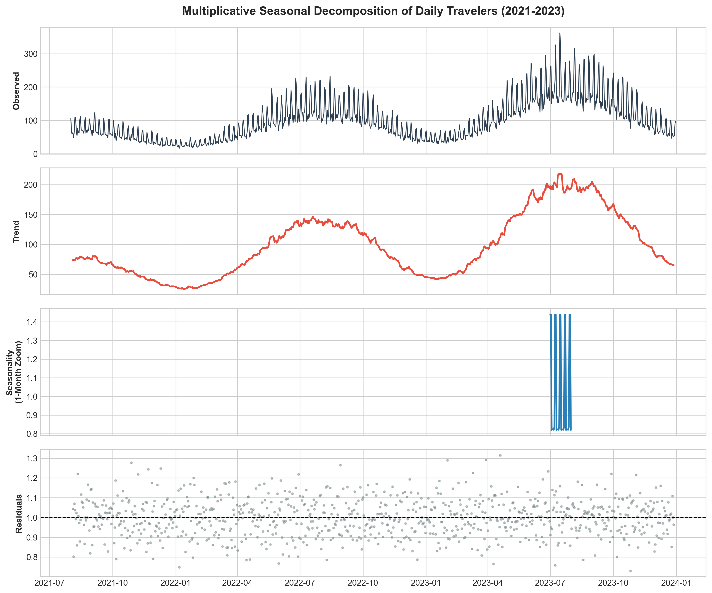
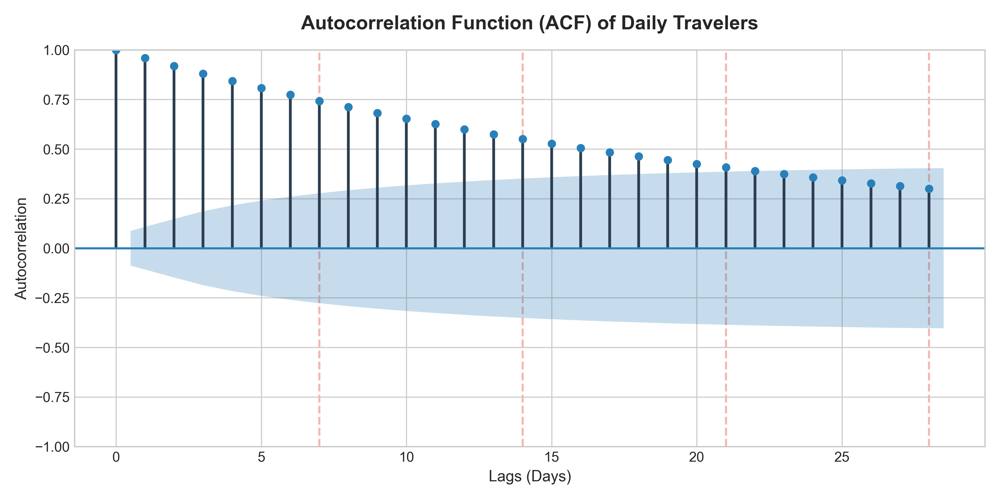
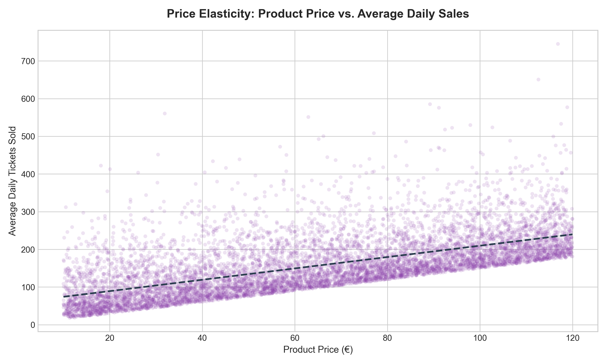
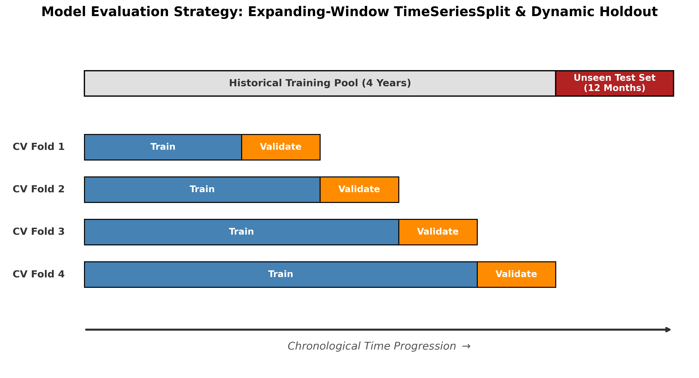
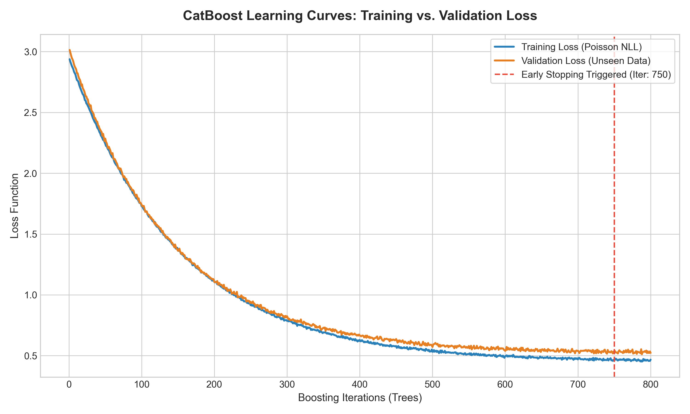
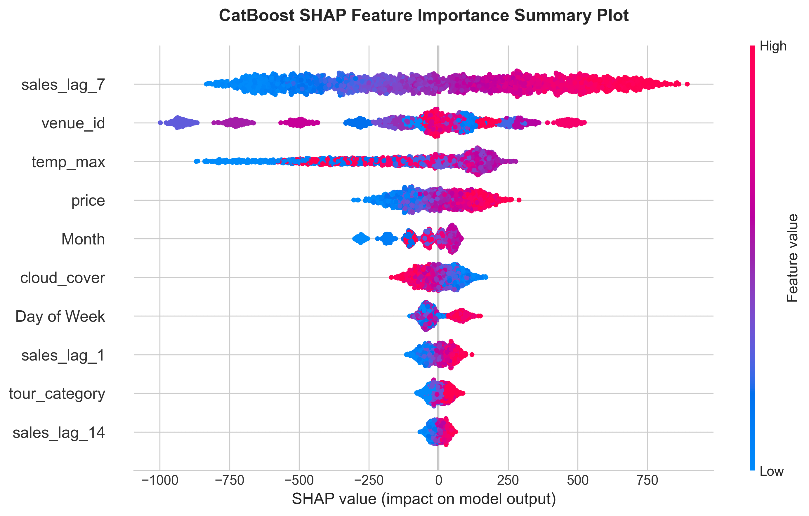
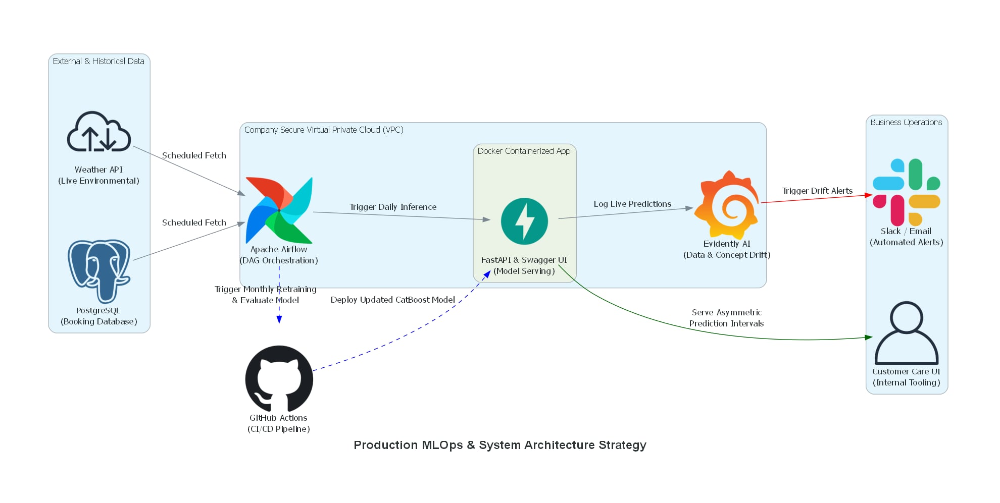

# Clio Muse: Ticket Prediction for Skip-The-Line Products
## Project Overview

**Objective**
To accurately forecast and purchase the optimal number of tickets from museums and archaeological sites for the company's skip-the-line (STL) products. The primary goal is to consistently satisfy daily customer demand without accumulating redundant, financially risky ticket inventory.

**The Problem**
Historically, the required number of tickets for each product was manually calculated by a product manager using static Excel formulas. This manual approach was unable to accurately predict the dynamic fluctuations in daily ticket demand, leading to operational inefficiencies such as unmet customer demand on busy days or capital wasted on unsold, dead inventory during slower periods.

**The Solution**
An internal ticket prediction system designed specifically for the customer care department. The tool accepts a product_id along with a selected start and end date as inputs. As output, it returns a data-driven confidence interval, providing a precise lower and upper bound on the number of tickets that must be secured for that specific product to safely meet demand while protecting company margins.

**Key Outcomes**
* Engineered a robust machine learning forecasting pipeline utilizing 5 years of historical PostgreSQL booking data alongside live environmental weather data.
* Successfully isolated and removed structural data anomalies, such as the COVID-19 pandemic window, while preserving true, high-volume business outliers.
* Solved the new-product "cold-start" problem by implementing temporal feature masking.
* Evaluated multiple advanced gradient boosting frameworks, including XGBoost, LightGBM, and CatBoost.
* Developed a final, highly accurate CatBoost model mathematically optimized with a Custom Asymmetric MAE metric to explicitly penalize overforecasting and minimize the financial risk of dead inventory.

**Tech Stack**
* ***Programming Languages:*** Python, SQL.
* ***Data Sources:*** PostgreSQL Database, Visual Crossing Weather API.
* ***Libraries:***
    * ***Data Processing & Analysis:*** Pandas, NumPy, Statsmodels.
    * ***Visualization:*** Matplotlib, Seaborn.
    * ***Machine Learning Frameworks:*** Scikit-Learn, XGBoost, LightGBM, CatBoost.

---

## Data Collection
Collected necessary data over 5 years (2019-2023) from a postgresql database using sql. Some of the collected data include:
* Information about venue characteristics, such as venue_id, the location of each venue, the ids and types of the products associated with each venue, and the price of each product.
* From all the records, we filtered the products to include only the STL (skip the line) products.
* Information about bookings, including travel date, product id, venue id and number of travelers per booking, which is the feature that we want to predict.
* Information about audio tours included in STL products, such as tour_id and tour category.

Since the demand for visiting venues is significantly affected by the weather, we also collected weather data for travel dates from Visual Crossing, which is a weather data api. Some of the data collected for the location of each venue and relevant dates are the expected minimum and maximum temperature, cloud coverage, and humidity.

---

## Data Cleaning/Preprocessing
Merged all the data in a dataframe and sorted all the information by travel date and venue.

* **Handling missing values in weather data:** We noticed that around 7% of the values returned by the api for some venues were null. To handle such values, we used two different strategies. For short gaps (< 5 days), we used linear interpolation (pandas.interpolate method) to take into account the trend of the weather. For larger gaps (>= 7 days), we scaled the weather features using min-max scaling and (MinMax Scaler from scikit-learn) filled missing values using K-Nearest Neighbors Imputation to exploit correlated features like humidity, temperature and cloud coverage.
* **Handling outliers in product demand:** While analyzing the trend of product demand over the years, we noticed that there was a significant drop in the number of travellers between March 2020 and July 2021, which was due to the covid-19 pandemic. Since this is not a representative sample of data, we removed records corresponding to this time window. While structural anomalies like the pandemic were removed, algorithmic outlier detection was intentionally bypassed for the daily target variable (number of travelers). In the tourism domain, anomalous high-volume days often represent true, highly profitable events (e.g., large group bookings) rather than measurement errors. Therefore, these records were preserved and their variance was managed later in the machine learning pipeline.

---

## Exploratory Data Analysis
In this stage, I performed a comprehensive analysis of the historical booking and weather data to identify the underlying drivers of demand and validate the feature set for the forecasting model. By examining temporal patterns, weather sensitivity, and product attributes, I explored the factors that most significantly influence daily traveler volume. This analysis was conducted using Pandas for data aggregation, Matplotlib and Seaborn for visualizing distributions and correlations, and Statsmodels for advanced time series decomposition and autocorrelation analysis.

* **Seasonal Decomposition:** To explore patterns in product sales over time, I performed Time Series Decomposition (using seasonal_decompose from statsmodels) to break down the daily, monthly, and yearly traveler count into Trend, Seasonal, and Residual components. I selected the multiplicative model to account for the growing variance in the number of travelers over time. The analysis of the trend component confirmed that there is a steady upward trend in the post-pandemic period (late 2021–2023), validating the decision to exclude the anomalous COVID-19 window. The seasonal component revealed a strong 7-day periodicity with sharp peaks on weekends, alongside a distinct annual seasonality where demand consistently surged during the summer months. This cyclicality proved that 'Day of Week' and 'Month' would be the important predictors for the model.

* **Autocorrelation Analysis:** Since lag features would potentially be good predictors for the model, I plotted the autocorrelation function and partial autocorrelation function (using functions plot_acf and plot_pacf from statsmodels). The ACF plot displayed significant spikes at Lag 7, 14, and 21, confirming a strong weekly correlation. The PACF plot showed a sharp cutoff after Lag 1, indicating that the number of travelers today is heavily dependent on the immediate past 24 hours.

* **Weather Correlation Analysis:** to validate the use of weather features as predictor variables, I plotted a correlation heatmap using the seaborn library, which revealed that the variables that had a strong correlation with the number of travelers were maximum temperature and cloud coverage.
* **Category-Based Demand Variance:** To explore the potential use of tour categories included in STL products as predictors, we created Boxplots to visualize the distribution of average daily bookings per tour category. The boxplots showed that combo tours (multi-site packages) have a much higher median than single-site tours.
* **Price Elasticity Analysis:** To verify whether price would be a good predictor, we plotted a scatterplot that shows the price against average daily sales. This surprisingly showed that more expensive STL products generally sell more.

* **Venue level hierarchy:** Exploring the use of venue location as a predictor in the model, we aggregated the total per venue id, and visualized the top 10 performing venues using a bar chart. The bar chart confirmed that specific venues have a very high demand regardless of the specific product associated with them.

---

## Feature Engineering
Building upon the insights uncovered during the Exploratory Data Analysis, the feature engineering phase transformed raw historical, environmental, and categorical data into highly predictive signals for the machine learning model. Guided by the time series and autocorrelation analysis, I utilized pandas datetime properties to extract temporal indicators, specifically 'Day of Week' and 'Month'. To capture both immediate momentum and strong weekly cyclicality, I generated historical lag features for periods of 1, 7, 14, and 21 days using the pandas.DataFrame.shift() method. Environmental variables sourced from the weather API were explicitly filtered down to include only maximum temperature and cloud coverage. Finally, to ensure the model could effectively forecast demand for newly introduced inventory, I incorporated static metadata features, such as tour category and venue ID.

To natively capture their inherently high baseline demand while preventing data leakage and overfitting, I applied Target Encoding using Scikit-Learn's TargetEncoder. Specifically, I integrated an automatic smoothing parameter (smooth='auto') to handle the "cold start" problem by shrinking the estimates of rare or newly added products toward the global mean. Additionally, to strictly respect the chronological order of the data and prevent future bookings from influencing historical features, the encoding was performed using Time Series Cross-Validation via Scikit-Learn's TimeSeriesSplit, while directly passing continuous variables like product price.

---

## Model Selection/Evaluation

### Simulated Cold-Start with Temporal Feature Masking
Before experimenting with different machine learning algorithms, I applied Simulated Cold-Start with Temporal Feature Masking to address the "cold-start" problem inherent to newly launched skip-the-line products. Technically, this was implemented in two steps. First, I calculated the "age" of each product by determining the difference in days between the booking's travel date and the date of the product's first ever recorded booking. Second, I conditionally nulled out all historical lag features for the first 30 days of every product's lifecycle in the training set. This taught the algorithms exactly how to behave when history is unavailable, drastically improving the model's robustness before any formal model training began.

### Dynamic Holdout Set for Model Evaluation
To ensure proper model evaluation, I implemented a Dynamic Holdout Set strategy for validation. Because the dataset represents a continuous time series of booking demand, standard randomized train-test splitting would introduce severe data leakage by allowing the algorithm to train on future events to predict past occurrences. To prevent this, I utilized a strict chronological split. Specifically, the model was trained on all available historical data except for the most recent 12 months, which were held out entirely as an unseen, forward-looking test set.

---

## Model Experimentation
In the model experimentation phase, various machine learning models were evaluated to identify the optimal model for forecasting daily traveler volume. The experimentation specifically focused on modern gradient boosting frameworks, namely XGBoost, LightGBM, and CatBoost. These advanced tree-based algorithms were selected because they excel at capturing complex, non-linear interactions within tabular datasets, seamlessly blending engineered historical lags, continuous environmental variables, and static categorical metadata. Most importantly for this specific business scenario, gradient boosting algorithms inherently handle the un-imputed null values deliberately introduced during the Simulated Cold-Start phase without requiring data distortion.

### Hyperparameter Optimization
To ensure a rigorous comparison between the different ML algorithms, hyperparameter tuning was systematically applied to all models prior to final evaluation. Comparing algorithms based on their default parameters introduces inherent bias, as aggressive frameworks like LightGBM tend to severely overfit noisy time-series data without explicit regularization, whereas others like CatBoost possess more generalized default behaviors. To optimize the models without incurring excessive computational overhead, I utilized randomized hyperparameter search spaces (RandomizedSearchCV from scikit-learn) focused specifically on structural complexity and regularization (e.g., tree depth, leaf sample minimums, and L2 penalties). This optimization was executed exclusively within the training data using an expanding-window TimeSeriesSplit. This ensured that each algorithm was forced to optimally balance the engineered lag features with the static metadata without ever leaking future data, establishing a mathematically level playing field before the final evaluation on the 12-month dynamic holdout set.

### XGBoost
Extreme Gradient Boosting was implemented using the xgboost Python library (XGBRegressor). Because the target variable (number of travelers) represents discrete, strictly non-negative booking events with a heavily right-skewed distribution, standard regression objectives like Mean Squared Error were mathematically suboptimal. Instead, the algorithm was configured to optimize for Poisson Regression (objective='count:poisson'). This allowed the algorithm's internal math engine to natively bound predictions at zero and appropriately model the proportional variance inherent to real-world ticket demand.

While the Poisson objective function handled the statistical reality of the data, the training evaluation metric was customized to reflect the business reality. Because Skip-the-Line tickets are purchased upfront and have low profit margins, overforecasting ticket demand is more costly than underforecasting. To mathematically enforce this constraint, I developed a Custom Asymmetric Mean Absolute Error (MAE) evaluation metric. This custom Python function applied a 2x penalty multiplier strictly to positive residuals (over-predictions). By coupling this custom metric with XGBoost's early_stopping_rounds method during training, the algorithm actively halted tree-building at the exact iteration that minimized financial risk, rather than optimizing for pure statistical symmetry.

Finally, when evaluating the fully trained model on the unseen 12-month dynamic holdout set, Standard MAE was utilized alongside residual analysis. Standard MAE was selected for this final testing phase because it provides business stakeholders with a highly interpretable baseline metric (i.e., quantifying exactly how many travelers the forecast is off by on an average day). Concurrently, plotting the test set residuals allowed me to visually verify that the custom asymmetric training metric successfully induced a deliberate left-skew (a slight underforecasting bias). This confirmed that the final model was not only highly accurate, but intentionally optimized to protect the company's profit margins from dead inventory.

### LightGBM
To benchmark against the XGBoost baseline, I implemented a Light Gradient Boosting Machine using the lightgbm Python library (LGBMRegressor). As the dataset's dimensionality expanded significantly due to engineered temporal lags and target-encoded metadata, LightGBM was selected for its computational efficiency. The algorithm utilizes a histogram-based binning technique that discretizes continuous variables, drastically accelerating training speed and reducing memory consumption on large time-series datasets.

The model was configured to utilize the exact same mathematical and business logic as the baseline architecture. It seamlessly integrated the Poisson regression objective to handle the right-skewed count data, natively processed the sparse NaN values introduced during the Simulated Cold-Start phase, and utilized the Custom Asymmetric MAE evaluation metric with early stopping to strictly penalize overforecasting. However, the primary algorithmic divergence between the models required targeted hyperparameter management. Unlike XGBoost's level-wise tree building, LightGBM utilizes a leaf-wise (best-first) growth strategy. While this minimizes the loss function more rapidly, it makes the model inherently more susceptible to overfitting on noisy daily demand fluctuations.

To counter this, strict regularization was enforced during the Time Series Cross-Validation phase. Specifically, the model's complexity was constrained by mathematically locking the num_leaves parameter strictly below the theoretical maximum dictated by the max_depth. Additionally, the min_child_samples parameter was elevated, forcing the algorithm to require a substantial cluster of historical evidence before forming a prediction rule. This ensured the model captured generalized seasonal demand patterns rather than memorizing anomalous single-day spikes. Finally, the optimized LightGBM model was evaluated on the unseen 12-month dynamic holdout set using Standard MAE, providing a direct, interpretable performance comparison against the XGBoost baseline.

### CatBoost
To complete the gradient boosting ensemble, we implemented the CatBoost algorithm using the catboost Python library (CatBoostRegressor). CatBoost was selected to complement the previously discussed models due to its proprietary architecture, which excels at processing high-cardinality metadata natively and enforcing strict chronological order. Unlike XGBoost and LightGBM, which required categorical features such as venue_id and tour_category to be pre-processed using Scikit-Learn's TargetEncoder, CatBoost's internal mathematical engine requires raw data. Therefore, we created an algorithm-specific pipeline fork to preserve the raw, unencoded categorical variables, passing them directly into the algorithm's cat_features parameter. This allowed the model to apply its native Ordered Target Statistics algorithm, which dynamically calculates target averages using strictly historical rows to mathematically guarantee zero target leakage. To further align with the continuous time series nature of the dataset and the dynamic holdout validation strategy, we enabled the has_time=True parameter to turn off random data permutations, ensuring the internal tree-building process strictly respects the physical timeline of the bookings.

To handle the inherent noise of daily tourism fluctuations, CatBoost relies on its built-in oblivious tree architecture. These symmetric trees enforce uniform feature splits across an entire depth level, acting as a powerful structural defense against overfitting. However, to prevent the algorithm from over-relying on the engineered historical lag features and memorizing anomalous single-day spikes, we applied an additional layer of explicit mathematical regularization. Specifically, the tree depth was constrained through the depth parameter, and parameters such as l2_leaf_reg and random_strength were tuned to restrict leaf weight explosion and inject variance into the split-scoring mechanism.

Finally, maintaining parity with the broader experimental framework, the algorithm was configured with the Poisson regression objective (loss_function='Poisson') to accurately model the discrete, right-skewed target variable. The model was actively trained using the Custom Asymmetric MAE evaluation metric to heavily penalize positive residuals (over-predictions). Technically, because CatBoost's engine processes custom metrics differently than the previous frameworks, this metric was implemented as a custom Python class rather than a simple function. By defining explicit class methods for error computation (evaluate) and optimization direction (is_max_optimal=False), the algorithm's early-stopping mechanism was safely guided to minimize the financial risk of dead inventory before being evaluated against the baseline models.

---

## Model Interpretability & Business Insights

### Learning Curve Analysis
To monitor the training process and diagnose potential underfitting or overfitting, learning curves were plotted for each algorithm. Technically, this was implemented by extracting the internal evaluation history dictionaries from each trained model (e.g., using evals_result() for XGBoost and LightGBM, and get_evals_result() for CatBoost) and visualizing the training and validation loss across all boosting iterations using the matplotlib library. The learning curves revealed distinct algorithmic behaviors. XGBoost maintained a stable, balanced fit with a consistent gap between training and validation errors. LightGBM demonstrated a very rapid initial decline in training error, indicating a slight tendency to overfit early on. However, the strict hyperparameter regularization and the early-stopping mechanism successfully halted this behavior before severe overfitting could corrupt the test predictions. Conversely, CatBoost exhibited the smoothest and most stable convergence. Its built-in oblivious tree architecture and explicit temporal tracking effectively prevented both underfitting and overfitting throughout the entire training cycle.

### Feature Importance & Business Validation
To extract actionable business insights and ensure absolute model transparency, I used **SHAP (SHapley Additive exPlanations)** values, which provides a mathematically consistent, unbiased evaluation based on cooperative game theory, revealing exactly *how* a feature pushes a prediction higher or lower.

The SHAP summary plot provided highly specific, directional insights that heavily validated the Exploratory Data Analysis phase:
* **Temporal & Metadata Dominance:** The engineered 7-day historical lag was the absolute dominant driver, proving that recent weekly momentum establishes the baseline volume. Static metadata, particularly `venue_id`, consistently pushed predictions significantly higher or lower depending on the specific location's inherent popularity.
* **Weather Thresholds (Directionality):** SHAP's color gradient revealed critical behavioral thresholds regarding environmental variables. For example, maximum temperature (`temp_max`) exhibited a non-linear impact: warm temperatures positively impacted ticket sales, but extreme heat (represented by high-value red dots shifting to the negative side of the SHAP axis) actively deterred tourists and reduced demand forecasts. Similarly, high cloud coverage (`cloud_cover`) consistently exerted a negative pull on predictions on gloomy days.
* **Price Elasticity:** The SHAP values confirmed the counter-intuitive pricing insight discovered during EDA: higher-priced products (often multi-site combo tickets) exerted a strong positive push on daily volume predictions compared to cheaper, single-site tickets.

### Final Model Selection
Based on a holistic evaluation of the learning curves, feature importances, and final predictive accuracy, CatBoost was selected as the superior and final forecasting model. When evaluated on the strictly unseen 12-month holdout set, CatBoost achieved the lowest Standard MAE, providing business stakeholders with the most accurate baseline predictions. Beyond pure accuracy, its learning curves proved it was the most structurally robust against the noise of daily tourism fluctuations, and its feature importance profile demonstrated an optimal balance between leveraging historical lag features and high-cardinality metadata. Ultimately, CatBoost proved to be the most reliable engine for minimizing the Custom Asymmetric MAE, safely guiding the algorithm to deliberately underforecast and minimize the financial risk of dead inventory.

---

## Future Work: MLOps & Production Deployment
Due to the constraints of the 3-month internship timeline, the primary focus of this project was engineering a robust, mathematically sound forecasting engine. However, to fully integrate this model into the Customer Care department's daily operations, the following Machine Learning Operations (MLOps) pipeline would be designed for future implementation:

### Asymmetric Prediction Intervals
To maximize the business value of the internal forecasting tool, the final deployment would be designed to output a confidence range rather than a static point estimate. In the context of Skip-the-Line ticket operations, the customer care department requires a reliable forecasting range rather than a single number to confidently secure daily ticket allotments from partner venues, schedule the correct number of tour guides, and manage traveler flow without over-committing capital. Furthermore, to align with the previously established business logic, where overforecasting carries a significantly higher financial risk (dead inventory) than underforecasting, an Asymmetric Prediction Interval would be implemented. This interval would be constructed using Conformal Prediction, a post-hoc residual analysis method. This specific method would be selected because it leverages the existing, highly optimized CatBoost model without requiring complex model retraining, and it naturally accounts for the real-world overdispersion of tourism data by relying on actual historical errors rather than theoretical distributions. Technically, the interval bounds would be implemented by calculating the prediction residuals on the 12-month dynamic holdout set and extracting skewed quantiles using <code>numpy.percentile</code>. By applying a relaxed lower bound (5th percentile of errors) as a safety net and a strict upper bound (the 80th percentile) as a ceiling to the model's daily point estimates, the final tool would provide a confident forecasting range that actively protects the company's profit margins.

### API Development & Secure deployment
The model would be containerized using Docker and deployed within the company’s secure Virtual Private Cloud (VPC) to ensure internal data privacy. The predictions would be served via a FastAPI application, providing the Customer Care team with an interactive Swagger UI to input travel dates and product IDs, while also allowing internal software engineers to easily integrate the endpoints into existing company dashboards.

### Automated Data & Retraining Pipelines
To maintain forecasting accuracy as consumer behavior evolves, automated pipelines will be orchestrated using a tool like Apache Airflow, which replaces traditional, rigid scheduling scripts. These Airflow DAGs (Directed Acyclic Graphs) will be configured to automatically fetch daily booking updates from the PostgreSQL database and live environmental data from the weather API, with built-in retry mechanisms in case of API timeouts. Furthermore, an automated monthly retraining pipeline will be established. This pipeline will trigger a fresh model training cycle on the latest historical data, evaluate it against the dynamic holdout set, and automatically deploy the updated model via CI/CD pipelines using GitHub Actions only if the new Mean Absolute Error outperforms the live version.

### System Monitoring
Finally, a continuous monitoring system is required to track the health of the production model. By integrating tools like Evidently AI, the system will actively monitor for Data Drift (e.g., anomalies in the incoming weather API structure) and Concept Drift (e.g., sudden changes in overall tourism demand patterns due to external market factors). If drift thresholds are breached, automated alerts will be triggered via Slack or email, ensuring the data science team can proactively intervene before business operations are impacted.

